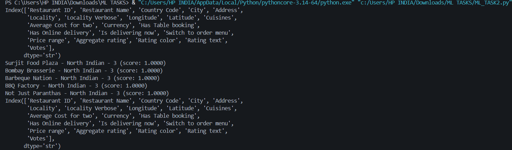
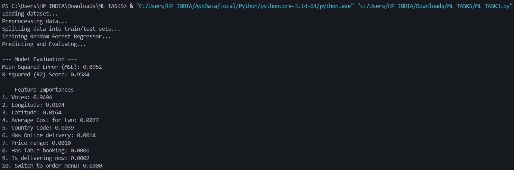
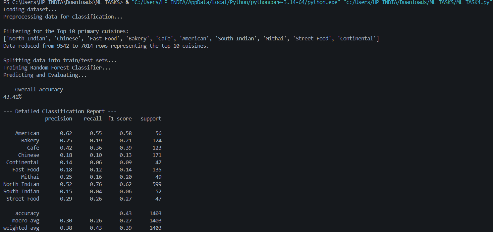

# Machine Learning Internship Tasks - Cognifyz Technologies

This repository contains the machine learning projects and tasks completed during my internship at **Cognifyz Technologies** in the month of February. The tasks primarily focus on data preprocessing, building recommendation systems, regression, and classification models using Python and Scikit-Learn.

## 📊 Dataset Overview
The tasks are based on a restaurant dataset (`Dataset.csv`) that includes various attributes such as:
* **Restaurant Details:** Name, ID, Country Code, City, Address, Locality.
* **Services:** Table booking, Online delivery, Order menu switch.
* **Metrics & Features:** Average Cost for two, Price range, Aggregate rating, Votes, Cuisines.
* **Location Data:** Longitude, Latitude.

## 🚀 Tasks Breakdown

### Task 2: Restaurant Recommendation System (`ML_TASK2.py`)
A content-based recommendation system that suggests restaurants to users based on their cuisine and price preferences.
* **Approach:** Encodes categorical features (Cuisines, Price range) and computes the **Cosine Similarity** between user preferences and the restaurant dataset.
* **Output:** Returns the top 5 most similar restaurants based on the user's input.
* **Result Snapshot:** 

### Task 3: Rating Prediction Regression Model (`ML_TASK3.py`)
A machine learning regression model designed to predict a restaurant's `Aggregate rating`.
* **Approach:** * Selected key features: Location (Longitude/Latitude), Cost, Booking/Delivery options, Price range, and Votes.
    * Applied `LabelEncoder` to categorical variables.
    * Trained a **Random Forest Regressor** (`n_estimators=100`).
* **Evaluation:** The model is evaluated using Mean Squared Error (MSE) and R-squared ($R^2$) metrics.
* **Result Snapshot:** 

### Task 4: Primary Cuisine Classification Model (`ML_TASK4.py`)
A classification model built to predict the primary cuisine a restaurant serves based on its features.
* **Approach:**
    * Extracted the "Primary Cuisine" (first cuisine listed) from the `Cuisines` column.
    * Filtered the dataset to focus on the top 10 most popular primary cuisines to ensure balanced classes.
    * Trained a **Random Forest Classifier** using balanced class weights.
* **Evaluation:** Assessed using standard classification metrics (Accuracy Score and Classification Report).
* **Result Snapshot:** 

## 🛠️ Technologies & Libraries Used
* **Language:** Python
* **Data Manipulation:** Pandas, NumPy
* **Machine Learning:** Scikit-Learn (`RandomForestRegressor`, `RandomForestClassifier`, `LabelEncoder`, `train_test_split`, `cosine_similarity`)

## ⚙️ How to Run the Projects

1. **Clone the repository:**
   ```bash
   git clone <your-repository-url>
   cd <your-repository-folder>
pip install -r requirements.txt

python ML_TASK2.py
python ML_TASK3.py
python ML_TASK4.py
